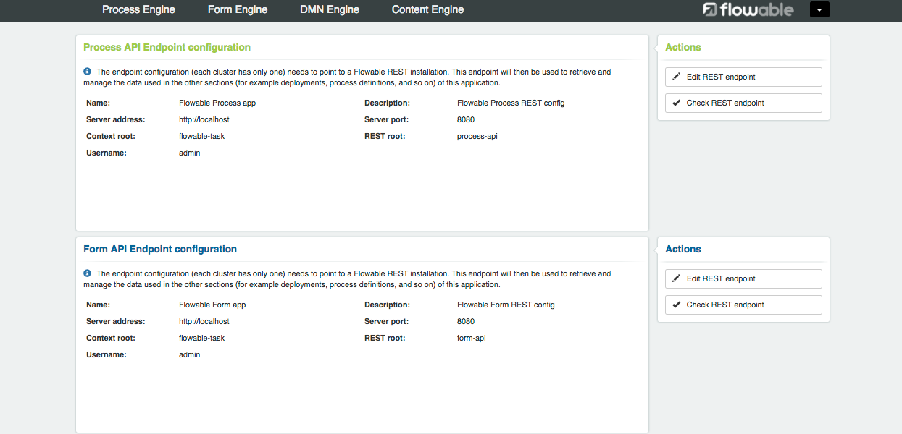

# Dockerized Flowable

The following text will explain how to perform a dockerized flowable with statefull database. This docker-compose is made of a tomcat+mysql and the tomcat will have the different .war used such as the flowable-rest war.

[](https://travis-ci.com/AMarti96/docker-flowable)
[](https://github.com/AMarti96/docker-flowable/issues)


**Table of contents:**<br>

**[Deployment](#deployment)**<br>
**[Check the REST service](#check-the-rest-service)**<br>
**[Check the UI services](#check-the-ui-services)**<br>

# Deployment

In order to get the docker-compose running the first step is clone the git project.

```
git clone https://github.com/AMarti96/docker-flowable.git
```

Then, move to the new folder created by the project.

```
cd docker-flowable
```

Inside this folder you can find both the docker-compose and different files for the configuration such the different .wars necessary to deploy flowable tomcat.

Now, in order to run the docker-compose you can easily run the following command:

```
docker-compose up -d
```

So now you will have your flowable instances running with a MySQL as a database running in the port 8080. 

# Check the REST service

In order to check everything is done correctly you can do the next request to the flowable-rest (it takes a bit to answer but don't worry):

```
http://localhost:8080/flowable-rest/service/management/engine
```
After this you will be asked for a User and a Password, for the flowable-rest it is ```User: kermit Password: kermit```

And you should recieve the following response:

```
{
  "name": "default",
  "resourceUrl": null,
  "exception": null,
  "version": "6.1.2.0"
}
```

Now you can start using your dockerized flowable REST API!

> NOTE: In case this does not respond properly to your request try to docker-compose down and docker-compose up again your project, this is because sometimes the database is created after the tomcat container so it is not initialized properly, but with the restart everything is fixed


# Check the UI services

All the UI flowable's services such as flowable-admin, task, modeler and idm can be easily checked if they are working by trying to access the next url:

```
http://localhost:8080/<floable-ui-service>
```

Where _<flowable-ui-service>_ can be any of the different ui-apps, such as:
 + flowable-admin 
 + flowable-modeler 
 + flowable-task
 + flowable-idm
 
Once you try to access it for the first time an idm user will be required, in this case it is ``` User: admin Password: test```. This parameters can be easily changed in the flowable-ui-app.properties.

Here you have an example of what you can see once you enter the flowable-admin page:



> NOTE: In case something doesn't work properly try to execute the docker-compose without the -d option and don't hesitate to ask me about the error.
